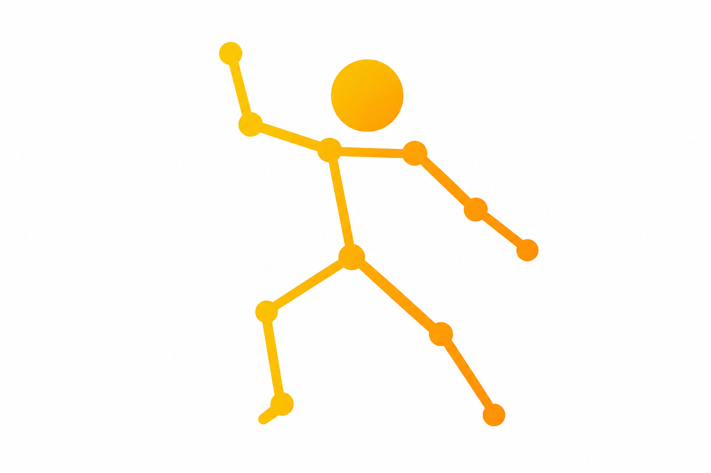

<p align="center">
  
</p>

<h1 align="center">FlashPose</h1>

<p align="center">
  <a href="https://pypi.org/project/flashpose/"></a>
  <a href="https://github.com/FlashVision/FlashPose/actions"></a>
  
  
  
  
  
</p>

<p align="center">
  <b>Production-grade 2D/3D human pose estimation, hand/face keypoints, action & gesture recognition</b>
</p>

<p align="center">
  <a href="#installation">Install</a> •
  <a href="#quick-start">Quick Start</a> •
  <a href="#models">Models</a> •
  <a href="#tasks">Tasks</a> •
  <a href="#solutions">Solutions</a> •
  <a href="#training">Training</a> •
  <a href="#contributing">Contributing</a>
</p>

---

## What is FlashPose?

FlashPose is an end-to-end pose estimation framework supporting **2D/3D human body pose**, **hand keypoints**, **face landmarks**, **action recognition**, and **gesture recognition**. It provides state-of-the-art architectures (ViTPose, HRNet, RTMPose) with a unified API.

```bash
pip install -e .
flashpose train --config configs/flashpose_body_17.yaml
flashpose predict --model best.pth --source video.mp4 --task body_2d
flashpose estimate --model best.pth --source webcam
```

---

## Installation

### pip (recommended)

```bash
git clone https://github.com/FlashVision/FlashPose.git
cd FlashPose
pip install -e .
```

### With all extras

```bash
pip install -e ".[all]"
```

### Docker

```bash
cd docker
docker compose up flashpose
```

### Verify installation

```bash
flashpose check
```

---

## Quick Start

### Python API

```python
from flashpose import FlashPose, PoseEstimator, Trainer
from flashpose.cfg import get_config

# Inference
estimator = PoseEstimator(model_path="best.pth", task="body_2d")
results = estimator.run("photo.jpg", visualize=True)

# Training
config = get_config(model_name="ViTPose", task="body_2d")
trainer = Trainer(config=config)
trainer.train(train_loader, val_loader)
```

### CLI

```bash
# Train
flashpose train --config configs/flashpose_body_17.yaml

# Predict
flashpose predict --model best.pth --source image.jpg --task body_2d

# Export to ONNX
flashpose export --model best.pth --output model.onnx --simplify

# Benchmark
flashpose benchmark --model best.pth --task body_2d
```

---

## Models

| Architecture | Params | Input | Head | Speed |
|---|---|---|---|---|
| ViTPose-S | ~22M | 256×192 | Heatmap | ~45 FPS |
| ViTPose-B | ~86M | 256×192 | Heatmap | ~30 FPS |
| HRNet-W32 | ~29M | 256×192 | Heatmap | ~35 FPS |
| HRNet-W48 | ~64M | 256×192 | Heatmap | ~25 FPS |
| RTMPose-S | ~5M | 256×192 | SimCC | ~90 FPS |
| RTMPose-M | ~13M | 256×192 | SimCC | ~60 FPS |

---

## Tasks

- **2D Body Pose** — COCO 17 keypoints (nose, eyes, ears, shoulders, elbows, wrists, hips, knees, ankles)
- **3D Body Pose** — Human3.6M 17 joints with 2D-to-3D lifting
- **Hand Pose** — 21 keypoints per hand (wrist + 4 joints per finger)
- **Face Landmarks** — 68-point face alignment
- **Whole-Body** — 133 keypoints (body + hands + face)
- **Action Recognition** — Skeleton-based activity classification (ST-GCN)
- **Gesture Recognition** — Rule-based hand gesture classification

---

## Solutions

### Pose Estimator

```python
from flashpose import PoseEstimator

estimator = PoseEstimator(model_path="best.pth", task="body_2d")
estimator.run_webcam(show=True)
```

### Action Classifier

```python
from flashpose.solutions import ActionClassifier

classifier = ActionClassifier(model_path="action.pth")
result = classifier.classify(skeleton_sequence)
print(f"Action: {result['action']} ({result['confidence']:.2f})")
```

### Gesture Recognizer

```python
from flashpose.solutions import GestureRecognizer

recognizer = GestureRecognizer()
result = recognizer.recognize(hand_keypoints)
print(f"Gesture: {result['gesture']}")
```

---

## Training

### From config

```bash
flashpose train --config configs/flashpose_body_17.yaml
```

### With LoRA

```bash
flashpose train --config configs/flashpose_body_17.yaml --lora
```

### Python API

```python
from flashpose import Trainer
from flashpose.cfg import load_yaml_config

config = load_yaml_config("configs/flashpose_body_17.yaml")
trainer = Trainer(config=config)
metrics = trainer.train(train_loader, val_loader)
```

---

## Evaluation Metrics

| Metric | Task | Description |
|---|---|---|
| PCK@0.5 | 2D Pose | Percentage of Correct Keypoints |
| AP | 2D Pose | Average Precision (OKS-based) |
| MPJPE | 3D Pose | Mean Per Joint Position Error (mm) |
| PA-MPJPE | 3D Pose | Procrustes-Aligned MPJPE |
| NME | Face | Normalized Mean Error |
| Accuracy | Action | Top-1 classification accuracy |

---

## Export

```bash
flashpose export --model best.pth --output model.onnx --simplify
```

```python
from flashpose import Exporter

exporter = Exporter(model_path="best.pth", task="body_2d")
exporter.export(output="model.onnx", simplify=True)
```

---

## Contributing

See [CONTRIBUTING.md](CONTRIBUTING.md) for guidelines.

---

## License

MIT License. See [LICENSE](LICENSE) for details.
